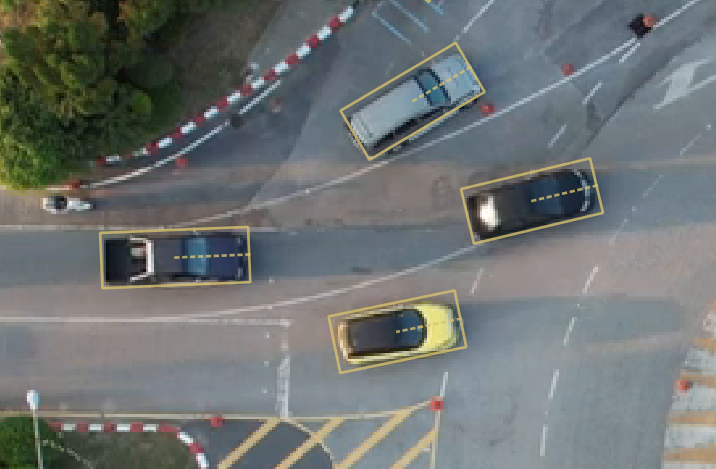
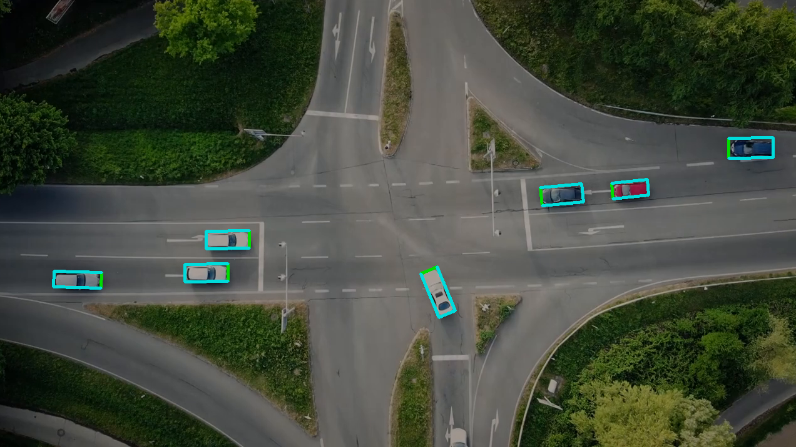
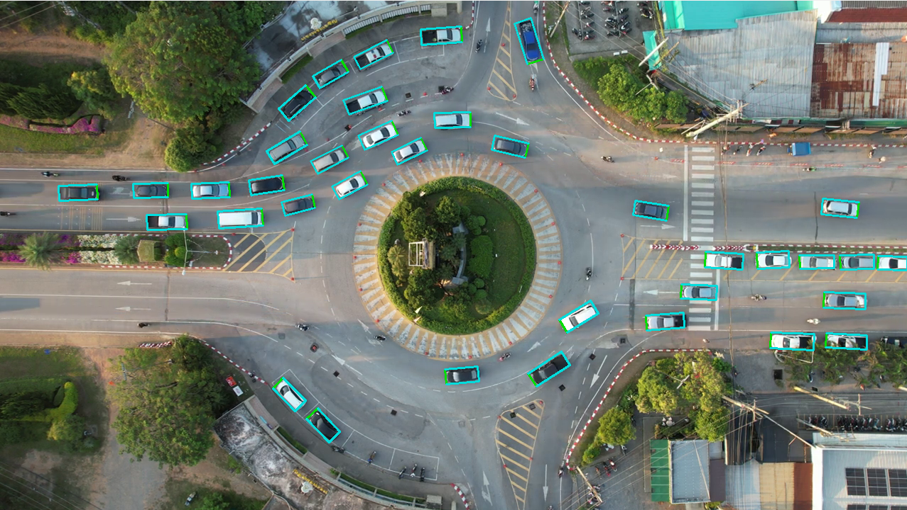

# Multi-object detection with oriented bounding box

In this directory, we describe how to train a Centernet-like network for detecting oriented/rotated bounding boxes of cars from a Bird Eye View (BEV) picture.

## Annotation

I have annotated [~150 images](images/) from drone images with [labelImg2](https://github.com/chinakook/labelImg2).

<p>
<em>LabelImg2</em></br>

</p>

Label files xml contains for each car:
- the center position
- the width and height of the bounding box
- the angle pointing towards vehicle direction

Note that we are not only annotating rotation of the bounding, but orientation too.

Images were taken from these 2 videos:
- https://www.youtube.com/watch?v=FpSau23yde4&ab_channel=LeonardSuchanek
- https://www.youtube.com/watch?v=bOhfs1-iecw&ab_channel=TaDream

Feel free to enhance your dataset with more samples to be more robust to any type!

## Data augmentation

I strongly recommend to augment your dataset. The most straightforward approach I came up with is to just randomly rotate your original images around image center, so that you are simultaneously changing cars position and orientation.

Run

```
mkdir images_augmented
python data_augmentation.py
```

This will write your augmented dataset to [images_augmented](images_augmented/) and export a csv file (train.csv).

To make sure your annotation is running fine, you can set `debug = True` inside.

<p>
<em>Data augmentation (front of cars in green)</em></br>

</p>

## Training with a CenterNet-like network

Please follow [jupyter notebook](centernet-oriented-bbox.ipynb)

At the end of this, you will end up with a .pth file.

Having a sine and a cosine heatmaps actually solved many problems that I had by predicting only one angle. If you try to predict the angle, you will have troubles with boundaries of the angle around vertical or horizontal axis. You will also find it quite difficult to define a correct metric to compute your loss. Apart from using more computational resources, this sine/cosine solution can output inconsistent values, and nothing guarantees that your cosine and sine values at your bounding box center norm to 1. This problem doesnt show up so often and we can easily filter out these detections.

## Test

You can test your network by using the `object_detector.py` at the root of this repo (with your weights or provided ones).

```
cd ..
python object_detector.py path/to/video.mp4 training/centernet-oriented-bbox.pth
```

Your detections will show up like this:

<p>
<em>Cars detections</em></br>

</p>